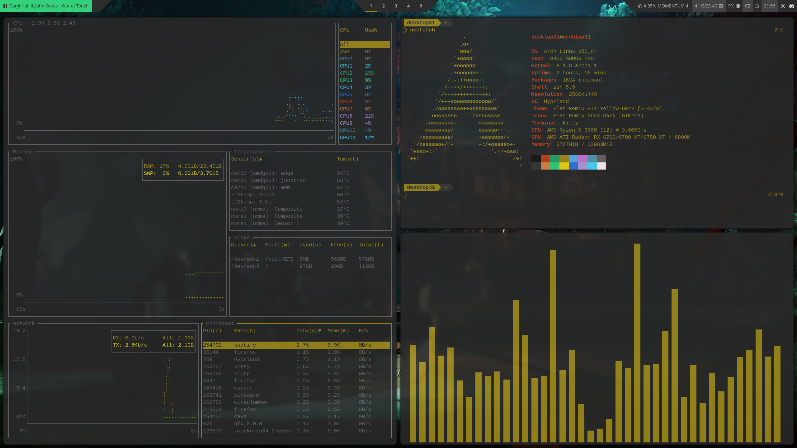

# Dots
My Arch linux configuration

will update readme later 

## Basic info
- lightdm (web-greeter + neon theme)
- custom patched DWM
- polybar (polybar-dwm-module)
- picom-animations-git
- zsh shell (with oh-my-zsh)
- pipewire + wireplumber
- micro editor 

and Czech keyboard :smrckaBat:

## Automatic installation (WIP!)
Run **autoinstall.sh** for automatic deployment.  
The script only deploys the config files and installs my preffered packages,  
it is meant to be run after Arch is fully installed, with network already set up.  
 
Make sure to run the script **as a user** and **from the directory** where it is located!

## Screenshot

