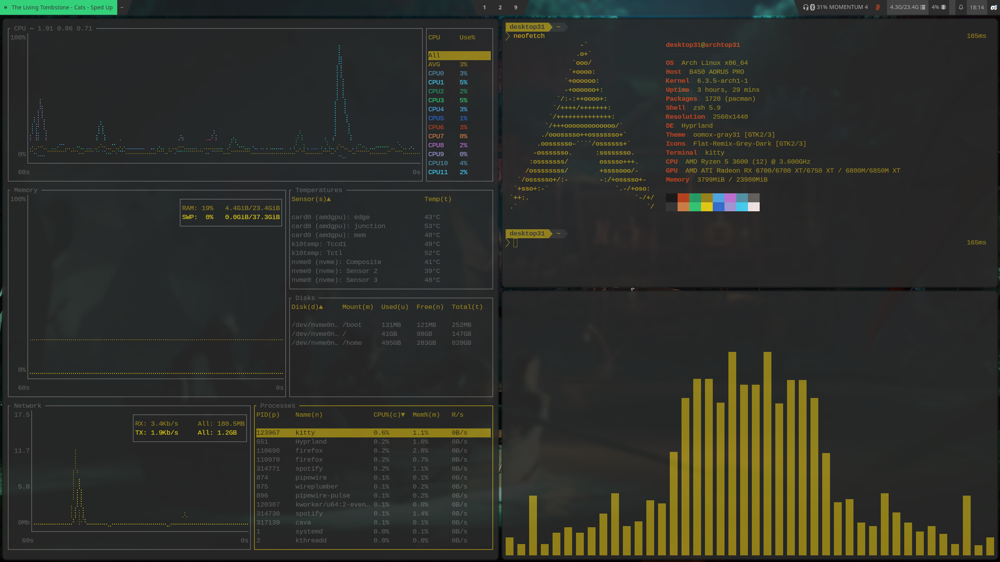

# Dots
My Arch linux configuration files

## Basic info
- lightdm (web-greeter + neon theme)
- pipewire + wireplumber
- editors: micro, neovim
- zsh shell (with oh-my-zsh)
- kitty terminal emulator
- Thunar
- WebCord
- lf (file manager)
- Rofi app launcher + powermenu

### Wayland
- Hyprland
- Waybar

### Xorg (config no longer maintained, Wayland is the way)
- custom patched DWM
- polybar (polybar-dwm-module)
- picom-animations-git

## Automatic installation
autoinstall script: https://github.com/Desktop31/autoinstall31

## Screenshot

